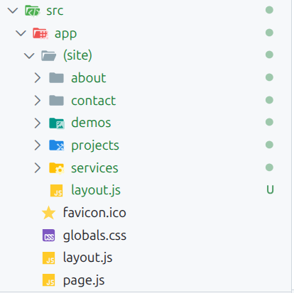
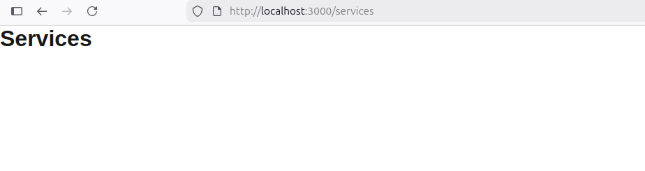

Sí, lo entendiste **casi perfecto**. Solo ajusto 2 detalles para que quede 100% correcto:

## 1) `src/app/page.js` (en la raíz)

* Ese `page.js` es la **ruta `/` (Home)**.
* No es “lo principal” por encima de todo; simplemente es **la página raíz**.

## 2) Lo que está dentro de `(site)`

* `(site)` es un **grupo** (no aparece en la URL).
* Todo lo que está ahí son rutas “del sitio público”, por ejemplo:

  * `src/app/(site)/services/page.js` → `/services`
  * `src/app/(site)/about/page.js` → `/about`

## 3) Carpetas = rutas (casi siempre)

* En Next App Router:

  * El **nombre de la carpeta** normalmente define la ruta.
  * Y el archivo `page.js` dentro define **qué se muestra** en esa ruta.

Ejemplo:

* Carpeta: `services`
* Archivo: `services/page.js`
* URL: `/services`

## 4) Lo importante: rutas dinámicas

* Si tienes `[slug]`, eso significa “cualquier nombre aquí”.
* `services/[slug]/page.js` → `/services/cualquier-cosa`

---

### Resumen en una línea (tal como tú lo dijiste)

✅ “Los títulos son los nombres de las carpetas y cada una tiene un `page.js` con la info de esa página” — **sí**.

Y también:
✅ `(site)` agrupa esas rutas para que compartan layout (Navbar/Footer) sin afectar otras rutas futuras.

